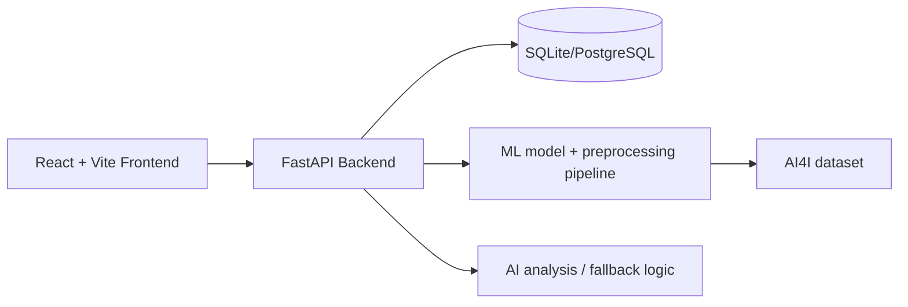

# MaintenAI

MaintenAI is an end-to-end predictive maintenance platform for industrial monitoring, fault prediction, maintenance planning, and AI-assisted decision support.

## Project overview

The system combines a machine learning model, a FastAPI backend, a local SQLite data layer (or PostgreSQL for Docker), and a React dashboard to support:
- machine fleet monitoring
- sensor ingestion and trend tracking
- predictive failure scoring
- health classification
- alert generation and tracking
- maintenance record management
- AI-supported explanation and recommendations

## Architecture



**Local Setup:** SQLite (file-based, no database server required)  
**Docker Setup:** PostgreSQL (optional, for containerized deployment)

## Features

- Leakage-safe XGBoost failure prediction
- Health states: NORMAL, WARNING, CRITICAL
- Dashboard metrics from API data
- Machine details and fleet views
- Alert deduplication and rule-based maintenance guidance
- Maintenance history tracking
- AI assistant for explanation and recommended actions
- Docker-based deployment

## Technology stack

- Frontend: React, TypeScript, Vite, Tailwind CSS, Recharts, Axios, React Router
- Backend: Python, FastAPI, Pydantic, SQLAlchemy, SQLite/PostgreSQL, Uvicorn
- ML: pandas, NumPy, scikit-learn, XGBoost, SHAP, joblib
- AI: environment-configured provider abstraction with rule-based fallback
- DevOps: Docker, Docker Compose, environment variables

## ML pipeline

This implementation uses the AI4I 2020 Predictive Maintenance dataset from the UCI repository. Failure-mode indicators are excluded because they can leak target information into the prediction model. The predictive columns are:
- Type
- Air temperature [K]
- Process temperature [K]
- Rotational speed [rpm]
- Torque [Nm]
- Tool wear [min]

The training flow uses:
1. dataset load and inspection
2. missing / duplicate validation
3. leakage-column removal
4. `ColumnTransformer` preprocessing
5. stratified train/test split
6. `scale_pos_weight` balancing
7. XGBoost training
8. evaluation and artifact export

## AI assistant

The AI endpoint receives a machine context composed of sensor readings, current health score, recent maintenance, and prediction history. If an LLM API key is not configured, the application falls back to a rule-based explanation system that clearly labels the recommendations as guidance rather than diagnoses.

## Database

**Local/Manual Setup:** SQLite file database (`maintenai.db`)  
**Docker Setup:** PostgreSQL (see `docker-compose.yml` for configuration)

The backend contains SQLAlchemy models for:
- machines
- sensor_readings
- predictions
- alerts
- maintenance_records

## API endpoints

Base path: `/api/v1`

- `GET /health`
- `GET /machines`
- `GET /machines/{machine_id}`
- `POST /machines`
- `GET /machines/{machine_id}/sensors`
- `POST /sensors`
- `POST /predict`
- `GET /predictions`
- `GET /alerts`
- `GET /maintenance`
- `POST /maintenance`
- `GET /dashboard/summary`
- `POST /ai/analyze`

## Frontend pages

- Login page
- Dashboard
- Machine list
- Machine detail view
- Predictions page
- Alerts page
- Maintenance history
- AI assistant
- Settings

## Installation

### Python setup

```bash
python -m venv venv
venv\Scripts\activate
pip install -r requirements.txt
pip install -r backend/requirements.txt
```

### Frontend setup

```bash
cd frontend
npm install
```

## Environment variables

### Backend Configuration

Copy `.env.example` to `.env` in the project root and adjust values for your environment:

```bash
copy .env.example .env
```

Key variables:
- `DATABASE_URL`: Set to `sqlite:///./maintenai.db` for local setup (default)
- `LLM_API_KEY`: Optional. Leave empty to use rule-based AI analysis
- `FRONTEND_URL`: Used for CORS configuration (default: `http://localhost:5173`)
- `VITE_API_URL`: Frontend build-time variable pointing to backend API

### Frontend Configuration

For production builds, set `VITE_API_URL` to your backend API URL before building:

```bash
cd frontend
VITE_API_URL=http://your-backend:8000/api/v1 npm run build
```

For local development, the frontend defaults to `http://localhost:8000/api/v1`.

## Running locally

### Backend

```bash
cd backend
uvicorn app.main:app --reload --host 0.0.0.0 --port 8000
```

### Frontend

```bash
cd frontend
npm run dev -- --host 0.0.0.0
```

## Running with Docker (Optional)

To run with PostgreSQL in containers:

```bash
docker compose up --build
```

Note: Local/manual setup uses SQLite and does not require Docker.

## Testing

```bash
cd backend
python -m pytest
cd frontend
npm run build
```

## Model training

```bash
python ml/src/train.py
```

## Deployment considerations

- use environment variables instead of hardcoded secrets (never commit `.env` with real credentials)
- for Docker deployment, ensure `POSTGRES_PASSWORD` environment variable is set securely
- keep the database and model artifacts in a managed environment for production
- add authentication and role-based access before exposing the platform externally
- use versioned model artifacts and retraining schedules

## Limitations

- This implementation uses a development authentication layer.
- AI recommendations are rule-based by default unless a live LLM API key is configured.
- This is a portfolio-focused prototype rather than an enterprise-grade industrial control system.

## Future improvements

- integrate authenticated user management
- add a message queue for streaming sensor ingestion
- expand monitoring with drift detection and forecast dashboards
- add more comprehensive SHAP and root-cause explanation views
- add CI/CD and cloud deployment templates

- Output: Contribution of each feature to predictions

---

## Performance Expectations

### Baseline Metrics (Phase 1)
- **Accuracy**: ~95-99% (high due to class imbalance)
- **Precision**: ~90-95% (few false alarms)
- **Recall**: ~80-90% (catches most failures)
- **F1-Score**: ~85-92% (balanced metric)
- **ROC-AUC**: ~0.90-0.95 (excellent discriminative ability)

*Note: Actual metrics will be computed from the real AI4I 2020 dataset during training.*

---

## Future Enhancements (Phase 2+)

- [x] **API Service**: FastAPI backend for real-time predictions
- [x] **Web Dashboard**: React frontend for model monitoring
- [ ] **Database**: PostgreSQL support for production deployments
- [ ] **IoT Integration**: Real-time data streaming from sensors
- [ ] **Advanced Models**: Deep Learning (LSTM/GRU for time series)
- [ ] **LLM Integration**: Natural language explanations
- [ ] **Model Monitoring**: Drift detection, retraining triggers
- [ ] **Hyperparameter Optimization**: Bayesian Optimization / Grid Search

---

## Requirements

### Python Environment
- Python 3.11+
- pip (Python package manager)

### Dependencies
All dependencies are listed in `requirements.txt`:
- **pandas**: Data manipulation
- **numpy**: Numerical computing
- **scikit-learn**: ML algorithms & preprocessing
- **xgboost**: Gradient boosting classifier
- **matplotlib & seaborn**: Data visualization
- **shap**: Model explainability
- **joblib**: Model serialization (also included with scikit-learn)
- **jupyter & ipykernel**: Notebook environment

---

## Troubleshooting

### "ModuleNotFoundError: No module named 'xgboost'"
```bash
pip install --upgrade xgboost
```

### "FileNotFoundError: data/ai4i2020.csv"
- Ensure you've downloaded the dataset from the UCI ML Repository
- Place the CSV file in the `data/` directory

### "No such file or directory: models/predictive_maintenance_model.pkl"
- Run `python src/train.py` first to generate the model

### Memory Issues (for large datasets)
- Reduce batch size or use sampling
- Monitor with `import psutil; psutil.virtual_memory()`

---

## Contributors & License

- **Phase 1**: Machine Failure Prediction ML Pipeline
- **License**: MIT (or specify your license)

---

## Contact & Support

For issues, questions, or contributions, please refer to the project repository.

---

**Last Updated**: 2026-08-18
**Status**: Phase 1 - ML Pipeline Complete
